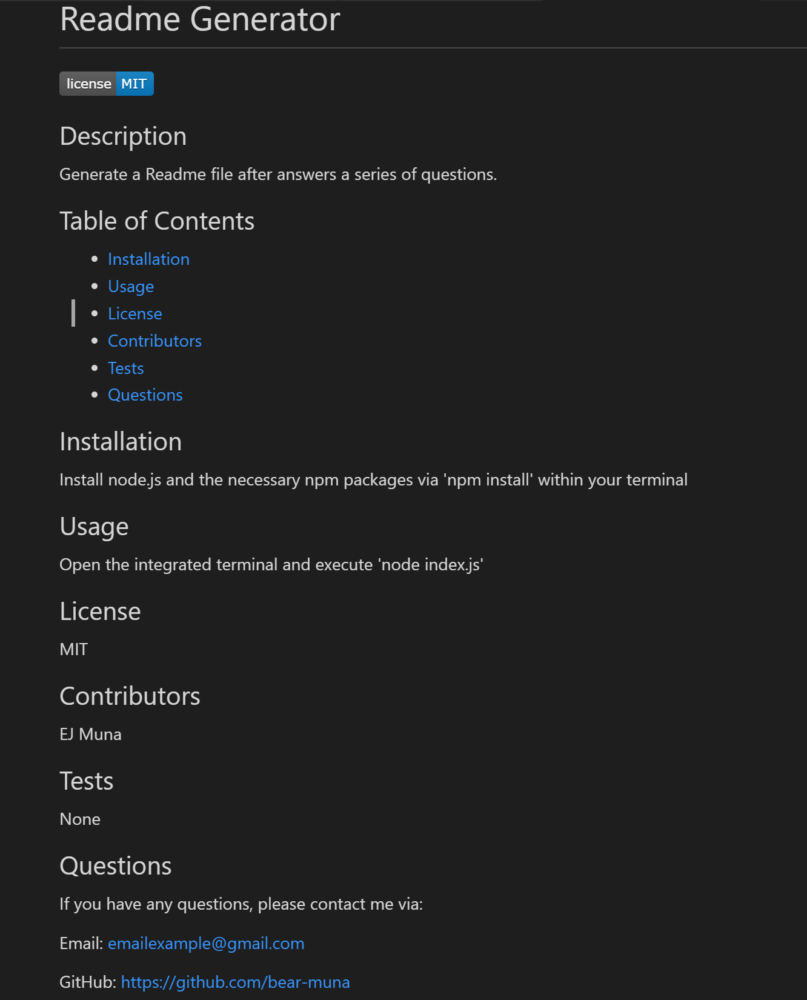

# README Generator

## Description
Welcome to the 'README Generator'. Here you will be able to generate your own README file after answering a series of prompts/questions within the terminal. This application was created using JavaScript, node.js, and some npm packages. 

## Installation
To install this application, you will need install node.js and install all the node_modules for this package. To install the node-modules, you will need to enter 'npm install' within the terminal.

## Usage
To use this application, you will need to open the application in a terminal. From the terminal, you will need to run the code via 'node index.js'. Here you will answer a series of questions. After answering all the questions, a README file will be generated within the 'gen' folder.

## License
Refer to License within the repository.

## Links
GitHub Repository: https://github.com/bear-muna/readme-generator

## Screenshots of Generated README File

## Video Recording of README Generator
